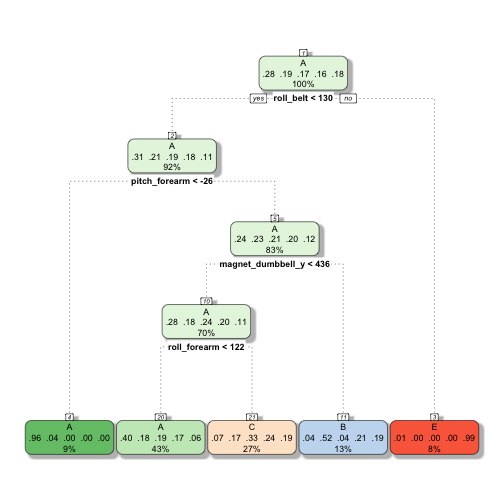
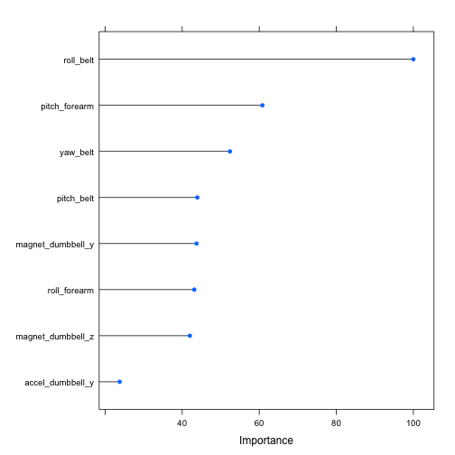

##Backround
Using devices such as Jawbone Up, Nike FuelBand, and Fitbit it is now possible to collect a large amount of data about personal activity relatively inexpensively. These type of devices are part of the quantified self movement – a group of enthusiasts who take measurements about themselves regularly to improve their health, to find patterns in their behavior, or because they are tech geeks. One thing that people regularly do is quantify how much of a particular activity they do, but they rarely quantify how well they do it. In this project, the goal will be to use data from accelerometers on the belt, forearm, arm, and dumbell of 6 participants. They were asked to perform barbell lifts correctly and incorrectly in 5 different ways. More information is available from the website here: http://groupware.les.inf.puc-rio.br/har (see the section on the Weight Lifting Exercise Dataset).

##Data

The training data for this project are available here:

<https://d396qusza40orc.cloudfront.net/predmachlearn/pml-training.csv>

The test data are available here:

<https://d396qusza40orc.cloudfront.net/predmachlearn/pml-testing.csv>


The data for this project come from this source: http://groupware.les.inf.puc-rio.br/har. If you use the document you create for this class for any purpose please cite them as they have been very generous in allowing their data to be used for this kind of assignment.


#Data Cleaning and Exploration

First we define and read in our datasets. 


```r
trainingurl = "pml-training.csv"
validationurl = "pml-testing.csv"

validation = read.csv(validationurl, na.strings=c("#DIV/0!", "NA","") )
train = read.csv(trainingurl,  na.strings=c("#DIV/0!", "NA","") )
```

Looking at the dataset, you can see that there are many variables that are filled with NA values. These variables cannot contribute to the final prediction model. So for simplicity we premtively disqualify them as potential features to our model. 


```r
train.na = apply(train, 2, function (x) sum(is.na(x))/19622)
train.na
```

```
##                        X                user_name     raw_timestamp_part_1 
##                0.0000000                0.0000000                0.0000000 
##     raw_timestamp_part_2           cvtd_timestamp               new_window 
##                0.0000000                0.0000000                0.0000000 
##               num_window                roll_belt               pitch_belt 
##                0.0000000                0.0000000                0.0000000 
##                 yaw_belt         total_accel_belt       kurtosis_roll_belt 
##                0.0000000                0.0000000                0.9798186 
##      kurtosis_picth_belt        kurtosis_yaw_belt       skewness_roll_belt 
##                0.9809398                1.0000000                0.9797676 
##     skewness_roll_belt.1        skewness_yaw_belt            max_roll_belt 
##                0.9809398                1.0000000                0.9793089 
##           max_picth_belt             max_yaw_belt            min_roll_belt 
##                0.9793089                0.9798186                0.9793089 
##           min_pitch_belt             min_yaw_belt      amplitude_roll_belt 
##                0.9793089                0.9798186                0.9793089 
##     amplitude_pitch_belt       amplitude_yaw_belt     var_total_accel_belt 
##                0.9793089                0.9798186                0.9793089 
##            avg_roll_belt         stddev_roll_belt            var_roll_belt 
##                0.9793089                0.9793089                0.9793089 
##           avg_pitch_belt        stddev_pitch_belt           var_pitch_belt 
##                0.9793089                0.9793089                0.9793089 
##             avg_yaw_belt          stddev_yaw_belt             var_yaw_belt 
##                0.9793089                0.9793089                0.9793089 
##             gyros_belt_x             gyros_belt_y             gyros_belt_z 
##                0.0000000                0.0000000                0.0000000 
##             accel_belt_x             accel_belt_y             accel_belt_z 
##                0.0000000                0.0000000                0.0000000 
##            magnet_belt_x            magnet_belt_y            magnet_belt_z 
##                0.0000000                0.0000000                0.0000000 
##                 roll_arm                pitch_arm                  yaw_arm 
##                0.0000000                0.0000000                0.0000000 
##          total_accel_arm            var_accel_arm             avg_roll_arm 
##                0.0000000                0.9793089                0.9793089 
##          stddev_roll_arm             var_roll_arm            avg_pitch_arm 
##                0.9793089                0.9793089                0.9793089 
##         stddev_pitch_arm            var_pitch_arm              avg_yaw_arm 
##                0.9793089                0.9793089                0.9793089 
##           stddev_yaw_arm              var_yaw_arm              gyros_arm_x 
##                0.9793089                0.9793089                0.0000000 
##              gyros_arm_y              gyros_arm_z              accel_arm_x 
##                0.0000000                0.0000000                0.0000000 
##              accel_arm_y              accel_arm_z             magnet_arm_x 
##                0.0000000                0.0000000                0.0000000 
##             magnet_arm_y             magnet_arm_z        kurtosis_roll_arm 
##                0.0000000                0.0000000                0.9832841 
##       kurtosis_picth_arm         kurtosis_yaw_arm        skewness_roll_arm 
##                0.9833860                0.9798695                0.9832331 
##       skewness_pitch_arm         skewness_yaw_arm             max_roll_arm 
##                0.9833860                0.9798695                0.9793089 
##            max_picth_arm              max_yaw_arm             min_roll_arm 
##                0.9793089                0.9793089                0.9793089 
##            min_pitch_arm              min_yaw_arm       amplitude_roll_arm 
##                0.9793089                0.9793089                0.9793089 
##      amplitude_pitch_arm        amplitude_yaw_arm            roll_dumbbell 
##                0.9793089                0.9793089                0.0000000 
##           pitch_dumbbell             yaw_dumbbell   kurtosis_roll_dumbbell 
##                0.0000000                0.0000000                0.9795638 
##  kurtosis_picth_dumbbell    kurtosis_yaw_dumbbell   skewness_roll_dumbbell 
##                0.9794109                1.0000000                0.9795128 
##  skewness_pitch_dumbbell    skewness_yaw_dumbbell        max_roll_dumbbell 
##                0.9793599                1.0000000                0.9793089 
##       max_picth_dumbbell         max_yaw_dumbbell        min_roll_dumbbell 
##                0.9793089                0.9795638                0.9793089 
##       min_pitch_dumbbell         min_yaw_dumbbell  amplitude_roll_dumbbell 
##                0.9793089                0.9795638                0.9793089 
## amplitude_pitch_dumbbell   amplitude_yaw_dumbbell     total_accel_dumbbell 
##                0.9793089                0.9795638                0.0000000 
##       var_accel_dumbbell        avg_roll_dumbbell     stddev_roll_dumbbell 
##                0.9793089                0.9793089                0.9793089 
##        var_roll_dumbbell       avg_pitch_dumbbell    stddev_pitch_dumbbell 
##                0.9793089                0.9793089                0.9793089 
##       var_pitch_dumbbell         avg_yaw_dumbbell      stddev_yaw_dumbbell 
##                0.9793089                0.9793089                0.9793089 
##         var_yaw_dumbbell         gyros_dumbbell_x         gyros_dumbbell_y 
##                0.9793089                0.0000000                0.0000000 
##         gyros_dumbbell_z         accel_dumbbell_x         accel_dumbbell_y 
##                0.0000000                0.0000000                0.0000000 
##         accel_dumbbell_z        magnet_dumbbell_x        magnet_dumbbell_y 
##                0.0000000                0.0000000                0.0000000 
##        magnet_dumbbell_z             roll_forearm            pitch_forearm 
##                0.0000000                0.0000000                0.0000000 
##              yaw_forearm    kurtosis_roll_forearm   kurtosis_picth_forearm 
##                0.0000000                0.9835898                0.9836408 
##     kurtosis_yaw_forearm    skewness_roll_forearm   skewness_pitch_forearm 
##                1.0000000                0.9835389                0.9836408 
##     skewness_yaw_forearm         max_roll_forearm        max_picth_forearm 
##                1.0000000                0.9793089                0.9793089 
##          max_yaw_forearm         min_roll_forearm        min_pitch_forearm 
##                0.9835898                0.9793089                0.9793089 
##          min_yaw_forearm   amplitude_roll_forearm  amplitude_pitch_forearm 
##                0.9835898                0.9793089                0.9793089 
##    amplitude_yaw_forearm      total_accel_forearm        var_accel_forearm 
##                0.9835898                0.0000000                0.9793089 
##         avg_roll_forearm      stddev_roll_forearm         var_roll_forearm 
##                0.9793089                0.9793089                0.9793089 
##        avg_pitch_forearm     stddev_pitch_forearm        var_pitch_forearm 
##                0.9793089                0.9793089                0.9793089 
##          avg_yaw_forearm       stddev_yaw_forearm          var_yaw_forearm 
##                0.9793089                0.9793089                0.9793089 
##          gyros_forearm_x          gyros_forearm_y          gyros_forearm_z 
##                0.0000000                0.0000000                0.0000000 
##          accel_forearm_x          accel_forearm_y          accel_forearm_z 
##                0.0000000                0.0000000                0.0000000 
##         magnet_forearm_x         magnet_forearm_y         magnet_forearm_z 
##                0.0000000                0.0000000                0.0000000 
##                   classe 
##                0.0000000
```

Any variable with at least the arbitary cutoff of 50% NA values is removed. Also removed are variables that conceptually should have no relationship with your dependent variable 'classe', such as the user name and timestamp variables. 


I subset the dataset into a training and testing dataset. I used a standard 60% for the training dataset. I also set the seed number on the day I conducted the analysis 2/28/2016 for better reproducability of results. 


```r
set.seed(2282016)
index = createDataPartition(train$classe, p=0.6, list = FALSE)
training = train[index,]
testing = train[-index,]
```

##Decision Tree Model

Now that my dataset is properly munged and subsetted. I run the prediction analysis. I decide to first run a tree base model using the R package 'rpart' and 'caret'.  Once the model is defined, the r package 'rattle' is used to create a fancy decision tree of the model. 


Looking at the model's accuracy we see we get an estimated 50% accuracy. We should be able to do much better than that.


```
## Confusion Matrix and Statistics
## 
##           Reference
## Prediction    A    B    C    D    E
##          A 2039  659  643  575  222
##          B   34  497   44  256  205
##          C  155  362  681  455  366
##          D    0    0    0    0    0
##          E    4    0    0    0  649
## 
## Overall Statistics
##                                           
##                Accuracy : 0.4927          
##                  95% CI : (0.4816, 0.5039)
##     No Information Rate : 0.2845          
##     P-Value [Acc > NIR] : < 2.2e-16       
##                                           
##                   Kappa : 0.3363          
##  Mcnemar's Test P-Value : NA              
## 
## Statistics by Class:
## 
##                      Class: A Class: B Class: C Class: D Class: E
## Sensitivity            0.9135  0.32740   0.4978   0.0000  0.45007
## Specificity            0.6261  0.91482   0.7935   1.0000  0.99938
## Pos Pred Value         0.4928  0.47973   0.3373      NaN  0.99387
## Neg Pred Value         0.9480  0.85007   0.8821   0.8361  0.88975
## Prevalence             0.2845  0.19347   0.1744   0.1639  0.18379
## Detection Rate         0.2599  0.06334   0.0868   0.0000  0.08272
## Detection Prevalence   0.5274  0.13204   0.2573   0.0000  0.08323
## Balanced Accuracy      0.7698  0.62111   0.6456   0.5000  0.72472
```

##Random Forest Model

Next, we try to conduct a random forest model. These models are known to be highly accurate at the expense of speed so while it will take longer to calculate we should get a more better results. 

To help with the speed, we set the controls to allow parallel processing.

```r
registerDoParallel()
ctrl = trainControl(classProbs=TRUE, savePredictions=TRUE, allowParallel=TRUE, number = 5)
```

We run the model and test its accuracy on the testing dataset. We obtained a 99.1% accuracy with the random forest model. This is much better than the decision tree model. 


```r
rf.model = train(classe ~ ., method = "rf", data = training, trControl = ctrl)
rf.prediction = predict(rf.model, testing)
confusionMatrix(rf.prediction, testing$classe)
```

```
## Confusion Matrix and Statistics
## 
##           Reference
## Prediction    A    B    C    D    E
##          A 2226   12    0    0    2
##          B    3 1501    9    1    1
##          C    2    4 1354   18    7
##          D    0    1    5 1267    5
##          E    1    0    0    0 1427
## 
## Overall Statistics
##                                           
##                Accuracy : 0.991           
##                  95% CI : (0.9886, 0.9929)
##     No Information Rate : 0.2845          
##     P-Value [Acc > NIR] : < 2.2e-16       
##                                           
##                   Kappa : 0.9886          
##  Mcnemar's Test P-Value : NA              
## 
## Statistics by Class:
## 
##                      Class: A Class: B Class: C Class: D Class: E
## Sensitivity            0.9973   0.9888   0.9898   0.9852   0.9896
## Specificity            0.9975   0.9978   0.9952   0.9983   0.9998
## Pos Pred Value         0.9938   0.9908   0.9776   0.9914   0.9993
## Neg Pred Value         0.9989   0.9973   0.9978   0.9971   0.9977
## Prevalence             0.2845   0.1935   0.1744   0.1639   0.1838
## Detection Rate         0.2837   0.1913   0.1726   0.1615   0.1819
## Detection Prevalence   0.2855   0.1931   0.1765   0.1629   0.1820
## Balanced Accuracy      0.9974   0.9933   0.9925   0.9918   0.9947
```

To gain a better understanding of which variables are important to the model and how it achieves it's high accuracy, we run caret's useful varImp function. We also plot the top 8 variables by 'classe' level.  Since the model only needs to be run once for one prediction, the whole model will be used for the final prediction. However, if speed and model simplicity were bigger factors, the variables shown would be great candidates to keep in the model. 


```r
var.imp = varImp(rf.model)
var.imp
```

```
## rf variable importance
## 
##   only 20 most important variables shown (out of 52)
## 
##                      Overall
## roll_belt             100.00
## pitch_forearm          60.82
## yaw_belt               52.40
## pitch_belt             43.93
## magnet_dumbbell_y      43.72
## roll_forearm           43.13
## magnet_dumbbell_z      41.99
## accel_dumbbell_y       23.77
## accel_forearm_x        17.18
## magnet_dumbbell_x      15.98
## magnet_belt_z          15.59
## roll_dumbbell          15.12
## magnet_forearm_z       14.06
## magnet_belt_y          14.03
## accel_dumbbell_z       13.59
## total_accel_dumbbell   13.54
## gyros_belt_z           12.22
## accel_belt_z           12.09
## yaw_arm                10.39
## magnet_belt_x           9.87
```

```r
plot(var.imp, top = 8)
```



##Conclusion: Final Prediction

Finally we use the model to predict the 'classe' category in the validation dataset. We use the random forest model, as it was the most accurate. 


```r
predict(rf.model, validation)
```

```
##  [1] B A A A A E D B A A B C B A E E A B B B
## Levels: A B C D E
```
